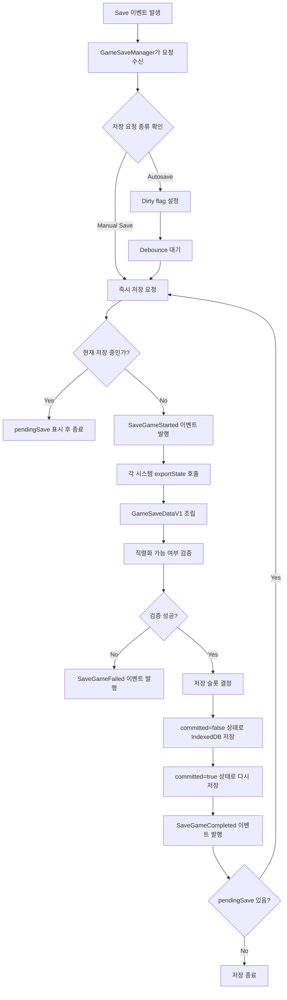
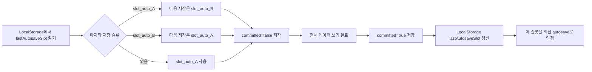
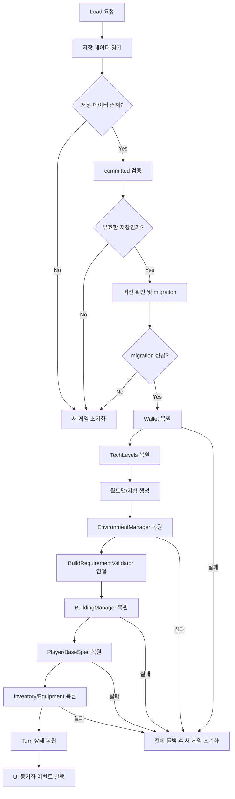
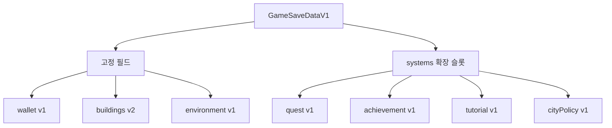
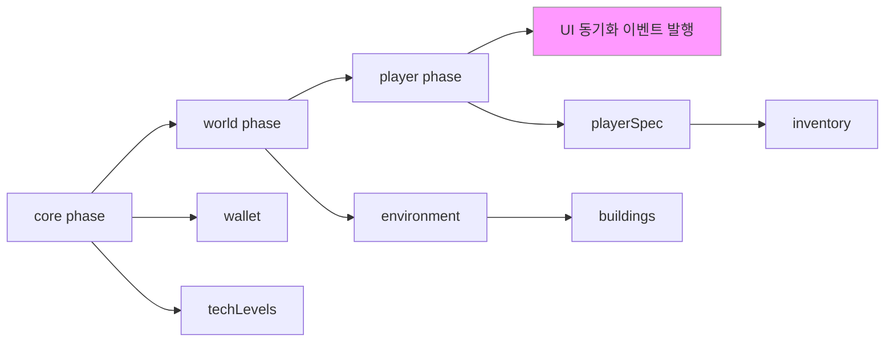
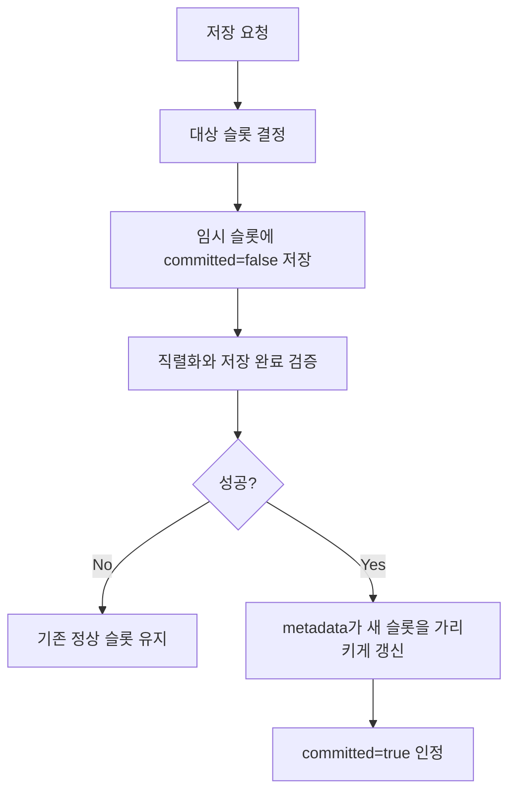

# Game Storage (세이브/로드 시스템) 설계 및 구현 계획

이 폴더는 게임 플레이 중 발생한 동적인 상태를 영구 저장하고, 다음 실행 또는 다음 로딩 때 동일한 상태로 복원하기 위한 중앙 저장 시스템을 관리합니다.

저장 대상은 건물, 환경 오브젝트, 재화, 테크 레벨, 턴 상태, 플레이어 스펙, 인벤토리처럼 게임 종료 후에도 유지되어야 하는 순수 데이터입니다. 렌더링용 `THREE.Object3D`, `InstancedMesh`, 이벤트 리스너, UI DOM, `PlacementManager`의 footprint 같은 런타임 캐시는 저장하지 않고 로딩 과정에서 다시 재구축합니다.

---

## 1. 최종 방향

현재 프로젝트에는 다음 구조가 가장 적합합니다.

1. `ISaveable<T>` 인터페이스로 저장 가능한 시스템의 계약을 통일합니다.
2. `GameSaveManager`가 각 시스템의 상태를 모아 하나의 `GameSaveData`로 저장하고, 로드 시 다시 분배합니다.
3. 저장소는 IndexedDB를 기본으로 사용합니다.
4. `Wallet`, `TechLevels`, `BuildingManager`는 전체 스냅샷 방식으로 저장합니다.
5. `EnvironmentManager`는 1차 구현에서는 전체 스냅샷으로 저장하고, deterministic seed 기반 생성이 준비된 뒤 `seed + modifiedObjects` 방식으로 최적화합니다.
6. `ResourceManager` 자체는 저장 대상이 아닙니다. 실제 저장 대상은 `WalletManager`의 재화 수량입니다.
7. `PlacementManager`는 저장하지 않습니다. 건물/환경 복원 과정에서 footprint를 다시 등록합니다.

환경 오브젝트는 수천 개까지 늘어날 수 있으므로 장기적으로는 seed-delta 방식이 유리합니다. 다만 현재 `EnvironmentManager`는 `Math.random()`으로 배치 여부, 회전, 스케일을 결정하므로 같은 옵션으로 다시 populate해도 결과가 달라질 수 있습니다. 따라서 정확한 복원을 먼저 보장하는 전체 스냅샷을 1차 목표로 삼고, 이후 seeded RNG와 stable object key를 도입한 뒤 최적화하는 단계형 접근을 권장합니다.

---

## 2. 핵심 아키텍처

### 2.1 `ISaveable` 인터페이스

상태 저장이 필요한 매니저와 시스템은 직렬화 가능한 순수 데이터만 내보내고, 저장된 데이터를 받아 런타임 객체를 재구축합니다.

```typescript
export interface ISaveable<T> {
  readonly saveVersion: number;
  exportState(): T;
  importState(data: T, savedVersion: number): Promise<void> | void;
}

export type SavePhase = "core" | "world" | "player";

export interface SaveableRegistrationOptions {
  phase: SavePhase;
  order: number;
  /**
   * 1차 구현에서는 사용하지 않습니다.
   * phase + order만으로 로드 순서를 결정합니다.
   * 시스템이 많아져 순환 의존성 문제가 생기면 위상 정렬 로직과 함께 도입합니다.
   */
  dependencies?: string[];
}
```

- `exportState`: JSON 변환 가능한 순수 데이터 객체를 반환합니다. `SaveEnvelope`로 감싸는 것은 각 시스템이 아니라 `GameSaveManager`가 담당합니다.
- `importState`: 저장 데이터를 기반으로 내부 상태, 모델, 캐시, footprint를 복원합니다. `savedVersion`을 받아 버전 차이가 있을 때 내부에서 필드 보정을 처리합니다.
- `saveVersion`: 이 시스템의 현재 데이터 포맷 버전입니다. `GameSaveManager`가 envelope 조립 시 사용합니다.
- 저장 데이터에는 `THREE.Vector3`, `Map`, `Set`, class instance를 그대로 넣지 않습니다. `{ x, y, z }`, 배열, plain object로 변환합니다.
- `phase`, `order`는 시스템이 늘어났을 때 로드 순서를 하드코딩하지 않기 위한 등록 메타데이터입니다. `dependencies`는 2차 이후 도입합니다.

### 2.2 `GameSaveManager`

`GameSaveManager`는 세이브 시스템의 중앙 조정자입니다.

- saveable registry 관리
- `wallet`, `techLevels`, `buildings`, `environment` 등 도메인 상태 수집
- 저장 슬롯 관리
- autosave debounce
- 로드 순서 제어
- 저장 데이터 버전 확인 및 migration 호출
- 로드 완료 후 UI 동기화 이벤트 발행

API 역할 구분:

```typescript
export class GameSaveManager {
  register<T>(
    key: string,
    saveable: ISaveable<T>,
    options: SaveableRegistrationOptions
  ): void;

  /** 각 시스템에서 상태를 수집하여 IndexedDB에 기록합니다. */
  save(slotId: string): Promise<void>;

  /** IndexedDB에서 raw 저장 데이터를 읽어 반환합니다. 시스템에 적용하지 않습니다. */
  load(slotId: string): Promise<GameSaveDataV1 | undefined>;

  /** load()로 데이터를 읽은 뒤 각 시스템의 importState()를 순서에 맞게 호출합니다. */
  applyToSystems(data: GameSaveDataV1): Promise<void>;

  /** load() + applyToSystems()를 한 번에 실행하는 편의 메서드입니다. */
  loadAndApply(slotId: string): Promise<boolean>;
}
```

`load`는 raw 데이터 조회만 담당하고, `applyToSystems`가 각 시스템에 분배합니다. `loadAndApply`는 두 단계를 묶은 편의 메서드입니다.

### 2.3 저장소 Backend

IndexedDB를 기본 저장소로 사용합니다. 기존 `worldmap/mapstore.ts`의 IndexedDB 패턴을 참고하되, 세이브 데이터용 범용 backend를 `gamestorage` 아래에 분리하는 편이 좋습니다.

```typescript
export interface IGameStorageBackend {
  save<T>(key: string, data: T): Promise<void>;
  load<T>(key: string): Promise<T | undefined>;
  remove(key: string): Promise<void>;
  list(prefix?: string): Promise<string[]>;
  /** 모든 항목 삭제. 디버그 및 초기화용. */
  clear(): Promise<void>;
}
```

권장 사용:

- IndexedDB: 세이브 파일 본문, 환경 오브젝트, 건물 상태
- LocalStorage: 마지막 슬롯 ID, autosave 설정, 작은 UI/설정값

---

## 3. 저장 데이터 계약

세이브 파일 최상위 구조는 버전과 도메인별 데이터를 명확히 나눕니다.

```typescript
export interface SaveEnvelope<T> {
  version: number;
  data: T;
}

export interface GameSaveDataV1 {
  version: 1;
  slotId: string;
  savedAt: number;
  committed: boolean;

  wallet: SaveEnvelope<WalletSaveData>;
  techLevels: SaveEnvelope<TechLevelsSaveData>;
  buildings: SaveEnvelope<BuildingManagerSaveData>;
  environment: SaveEnvelope<EnvironmentManagerSaveData>;

  turn: SaveEnvelope<TurnSaveData> | null;
  player: SaveEnvelope<PlayerSaveData> | null;
  inventory: SaveEnvelope<InventorySaveData> | null;

  /**
   * 핵심 필드에 아직 편입하지 않은 확장 시스템용 저장소입니다.
   * 예: quest, achievement, tutorial, cityPolicy, npcRelationship.
   */
  systems?: Record<string, SaveEnvelope<unknown>>;
}

export interface Vector3SaveData {
  x: number;
  y: number;
  z: number;
}
```

`version`은 필수입니다. 저장 포맷이 바뀔 때 migration을 추가하기 위해 최상위에 둡니다.

각 도메인 데이터는 `SaveEnvelope<T>`로 감싸서 도메인별 `version`을 별도로 가집니다. 전체 세이브 포맷은 그대로 두고 건물, 환경, 인벤토리 같은 일부 시스템만 migration해야 할 때 유리합니다.

`turn`, `player`, `inventory`는 미구현 단계에서는 `null`로 명시합니다. `undefined`로 두면 직렬화 시 키 자체가 사라져 migration 조건 판별이 어려워집니다.

새 시스템이 추가될 때마다 최상위 타입을 반드시 수정하지 않도록 `systems` 확장 슬롯을 둡니다. 핵심 시스템은 타입 안정성을 위해 명시 필드로 유지하고, 퀘스트/업적/튜토리얼/도시 정책처럼 후속 모듈은 `systems`에 등록형으로 저장할 수 있습니다.

`systems`는 optional이므로 기존 저장 파일(systems 없음)을 로드할 때 `undefined`가 들어옵니다. `applyToSystems()` 내부에서 반드시 `save.systems ?? {}`로 초기화한 뒤 접근합니다.

---

## 4. 시스템별 저장/복원 전략

### 4.1 Wallet & Resource

저장 대상:

- `WalletManager`의 재화 수량

저장하지 않는 대상:

- `ResourceManager`
- `ResourceAmountChanged` 이벤트 로그
- UI 표시 상태

`ResourceManager`는 자원 변경 요청을 받아 `WalletManager`에 반영하고 이벤트를 발행하는 라우터에 가깝습니다. 따라서 세이브 데이터에는 최종 재화 수량만 있으면 됩니다.

```typescript
export type WalletSaveData = Partial<Record<CurrencyType, number>>;
```

로드 시에는 누락된 재화 키를 0으로 보정한 뒤 `WalletManager`에 주입합니다. 버전업으로 새 `CurrencyType`이 추가된 경우에도 동일하게 0 보정을 적용하고, migration 함수에서 초기값을 별도로 지정할 수 있습니다.

### 4.2 TechTreeService

저장 대상:

- `TechTreeService.levels`

저장하지 않는 대상:

- 계산 가능한 비용
- 요구사항 평가 결과
- UI에서 표시 중인 available list

```typescript
export type TechLevelsSaveData = Record<string, number>;
```

로드 시 `TechTreeService` 생성 전에 주입하거나, 생성 후 `levels`를 교체합니다. 버전업으로 새 tech 키가 추가된 경우 누락된 키를 기본값(0 또는 1)으로 보정합니다.

### 4.3 BuildingManager

건물은 전체 스냅샷 방식으로 저장합니다.

저장 대상:

- 완성된 건물 목록
- 건설 중인 작업 목록
- 건물 ID 카운터 또는 다음 ID
- task ID 카운터 또는 다음 task ID
- 건물별 런타임 상태

```typescript
export interface BuildingManagerSaveData {
  nextBuildingId: number;
  nextTaskId: number;
  activeTasks: BuildingTaskSaveData[];
  buildings: BuildingObjectSaveData[];
}

export interface BuildingTaskSaveData {
  id: string;
  nodeId: string;
  position?: Vector3SaveData;
  progress: number;
  /**
   * 턴 기반 게임: remainingTurns를 우선 사용합니다.
   * 실시간 게임: elapsedSeconds를 우선 사용하고 remainingTurns는 보조값으로 유지합니다.
   * 로드 시 startedAt은 재사용하지 않고 현재 시각으로 재설정합니다.
   */
  remainingTurns: number;
  elapsedSeconds: number;
}

export interface BuildingObjectSaveData {
  id: string;
  nodeId: string;
  level: number;
  hp: number;
  position: Vector3SaveData;
  /**
   * 건물 타입별 추가 런타임 속성.
   * exportState() 내부에서 반드시 JSON.parse(JSON.stringify(...))로 직렬화 가능 여부를 검증합니다.
   * THREE.Object3D, Map, Set, 함수를 포함하면 안 됩니다.
   */
  runtime: BuildingRuntimeSaveData | null;
}

export interface BuildingRuntimeSaveData {
  version: number;
  kind: string;
  data: Record<string, unknown>;
}
```

복원 원칙:

- `startBuild()`를 호출하지 않습니다.
- `startBuild()`는 비용 차감, 배치 검사, 타이머 초기화를 포함하므로 로드 복원에 사용하면 안 됩니다.
- 복원 전용 factory를 둡니다.
- 모델을 로드하고, `ResourceProduction`, `DefenseTurret`, `UnitProduction` 등 적절한 건물 객체를 직접 생성합니다.
- 완성 건물과 건설 중 task 모두 `PlacementManager`에 footprint를 다시 등록합니다.
- 복원 후 `ResponseBuilding` 같은 상태 동기화 이벤트를 한 번 발행합니다.

권장 내부 API:

```typescript
private async restoreBuildingObject(data: BuildingObjectSaveData): Promise<void>;
private async restoreBuildTask(data: BuildingTaskSaveData): Promise<void>;
```

건물 ID는 `Date.now()` 기반보다 카운터 기반이 좋습니다.

```
building_1
building_2
task_1
task_2
```

카운터도 저장해야 다음 생성 시 ID 충돌이 없습니다.

### 4.4 EnvironmentManager

환경 저장은 2단계로 나눕니다.

#### 1차 구현: 전체 스냅샷

현재는 정확한 복원이 우선입니다. 모든 환경 오브젝트의 논리 상태를 저장합니다.

```typescript
export type EnvironmentManagerSaveData =
  | EnvironmentSnapshotSaveData
  | EnvironmentSeedDeltaSaveData;

export interface EnvironmentSnapshotSaveData {
  mode: "snapshot";
  idCounter: number;
  objects: EnvironmentObjectSaveData[];
}

export interface EnvironmentSeedDeltaSaveData {
  mode: "seed-delta";
  idCounter: number;
  generation: EnvironmentGenerationSaveData;
  modifiedObjects: EnvironmentObjectDeltaSaveData[];
}

export interface EnvironmentObjectSaveData {
  id: string;
  nodeId: string;
  position: Vector3SaveData;
  rotationY: number;
  scale: number;
  currentAmount: number;
  isDepleted: boolean;
  useInstancing: boolean;
}
```

복원 시 `instanceIndex`는 저장값을 재사용하지 않고 새로 배정합니다. `InstancedMesh`, `baseMatrices`, spatial grid, clusters, footprint는 import 과정에서 다시 만듭니다.

#### 2차 최적화: seed + 변경점

환경 생성이 deterministic해진 뒤에는 전체 오브젝트를 저장하지 않고 생성 조건과 변경점만 저장합니다.

```typescript
export interface EnvironmentGenerationSaveData {
  seed: string;
  nodeId: string;
  method: "ground-radial-paths" | "noise" | "radial-paths";
  options: Record<string, unknown>;
}

export interface EnvironmentObjectDeltaSaveData {
  key: string;
  currentAmount: number;
  isDepleted: boolean;
}
```

seed-delta 방식으로 전환하기 전에 필요한 선행 조건:

- `Math.random()` 대신 seeded RNG 사용
- 같은 seed와 options에서 항상 같은 환경 생성
- 오브젝트 식별자를 stable key로 생성
- 예: `pine_tree:12:-8`
- random rotation과 random scale도 seed에서 재현하거나 저장
- 채집/고갈된 오브젝트를 stable key 기준으로 기록

이 조건이 충족되지 않은 상태에서 seed만 저장하면, 다음 로딩 때 다른 위치의 나무가 사라지거나 자원량이 엉뚱한 오브젝트에 적용될 수 있습니다.

### 4.5 PlacementManager

`PlacementManager`는 저장하지 않습니다.

이유:

- footprint는 원본 데이터가 아니라 배치 검사용 인덱스입니다.
- 건물과 환경 복원 과정에서 충분히 재구성할 수 있습니다.
- 별도 저장하면 원본 데이터와 footprint가 불일치할 위험이 큽니다.

복원 과정에서 다음 대상만 다시 등록합니다.

- 완성 건물
- 건설 중 건물
- 활성 환경 오브젝트

### 4.6 BaseSpec

저장 대상:

- `level`
- `exp`
- 현재 `hp`, `mp`, `stamina`
- 초기 베이스 스탯 또는 성장에 필요한 최소 원본값

저장하지 않는 대상:

- 장비, 버프, 패시브가 반영된 최종 스탯

로드 시:

1. 레벨과 경험치를 복구합니다.
2. `UpdateStatsByLevel()`과 `UpdateExpRequirement()`를 호출합니다.
3. 현재 HP/MP는 계산된 최대치 안으로 clamp합니다.
4. 장비와 버프는 이후 단계에서 재적용합니다.

### 4.7 Inventory & Equipment

저장 대상:

- 슬롯별 item ID
- 수량
- 장착 여부
- 아이템별 내구도, 강화 수치 등 런타임 속성

로드 시:

1. 인벤토리 슬롯을 먼저 복원합니다.
2. 장착 중이던 아이템은 `Equip(item)`을 다시 호출합니다.
3. 이를 통해 장비 modifier가 복원된 `BaseSpec`에 안전하게 다시 합산됩니다.

---

## 5. 로드 순서

의존성 문제를 줄이기 위해 로드는 아래 순서를 따릅니다.

1. `GameSaveManager.load(slotId)`로 저장 데이터를 읽습니다.
2. `WalletManager.importState(save.wallet)`를 적용합니다.
3. `TechTreeService`에 `save.techLevels`를 적용합니다.
4. 지형과 월드맵을 생성합니다.
5. `EnvironmentManager`를 생성합니다.
6. 저장 데이터가 있으면 `EnvironmentManager.importState()`를 호출합니다.
7. 저장 데이터가 없으면 최초 환경 populate를 실행합니다.
8. `BuildRequirementValidator`를 `EnvironmentManager`와 연결합니다.
9. `BuildingManager.importState()`를 호출합니다.
10. 플레이어 `BaseSpec`을 복원합니다.
11. 인벤토리와 장비를 복원하고 장착 효과를 재적용합니다.
12. 턴 상태를 복원합니다.
13. 모든 복원이 끝난 뒤 UI 동기화 이벤트를 발행합니다.

건물 배치 검사는 환경 footprint를 참조할 수 있으므로 `EnvironmentManager` 복원이 `BuildingManager` 복원보다 먼저 끝나는 편이 안전합니다.

---

## 6. 저장 타이밍

매 프레임 저장하지 않습니다. 상태가 의미 있게 바뀌는 순간 dirty flag를 세우고 debounce 후 저장합니다.

dirty flag 후보:

- `ResourceAmountChanged`
- 건설 시작
- 건설 완료
- 건물 업그레이드 시작/완료
- 환경 자원 채집
- 환경 오브젝트 고갈
- 턴 종료
- 인벤토리 변경
- 장비 변경

즉시 저장 후보:

- `visibilitychange`
- `pagehide`
- `beforeunload`
- 수동 저장 버튼

권장 debounce:

```typescript
/** 환경 오브젝트가 수천 개일 경우 직렬화 비용이 있으므로 2000ms 이상을 권장합니다. */
const AUTOSAVE_DEBOUNCE_MS = 2000;
```

### autosave 슬롯 로테이션

쓰기 도중 크래시 시 저장 파일이 손상될 수 있습니다. autosave는 `slot_auto_A`와 `slot_auto_B`를 번갈아 사용하고, 쓰기 완료 후 `committed: true` 플래그를 기록합니다. 로드 시에는 `committed: true`인 슬롯 중 `savedAt`이 가장 최신인 것을 선택합니다.

`committed`는 `GameSaveDataV1` 최상위 필드에 포함합니다. 저장 중인 데이터는 `committed: false`로 쓰고, 모든 데이터 기록이 끝난 뒤 같은 슬롯을 `committed: true`로 다시 기록합니다.

---

## 7. Save Event Flow

세이브는 각 시스템이 직접 저장소에 쓰는 방식이 아니라, `GameSaveManager`가 중앙에서 한 번에 스냅샷을 수집하고 저장하는 방식으로 동작합니다.

핵심 원칙:

- 저장 요청은 이벤트로 들어옵니다.
- autosave는 dirty flag와 debounce를 거쳐 저장합니다.
- manual save는 debounce를 우회해 즉시 저장합니다.
- 저장 중 중복 요청이 오면 현재 저장이 끝난 뒤 한 번 더 저장합니다.
- 실제 저장 데이터는 각 시스템의 `exportState()` 결과를 합친 `GameSaveDataV1`입니다.
- 저장소 기록은 `committed` 플래그를 사용해 쓰기 중단 상황에 대비합니다.

### 7.1 전체 흐름



### 7.2 Save Request 종류

Manual Save:

- 플레이어가 직접 저장 버튼을 누르거나 명시적으로 저장을 요청한 경우입니다.
- debounce를 거치지 않습니다.
- 지정된 manual slot에 저장합니다.
- 실패 시 UI에 즉시 알릴 수 있습니다.

Autosave:

- 게임 상태가 의미 있게 변경되었을 때 자동으로 저장하는 방식입니다.
- 매 변경마다 바로 저장하지 않습니다.
- dirty flag만 세운 뒤 debounce합니다.
- autosave 슬롯은 `slot_auto_A`, `slot_auto_B`를 번갈아 사용합니다.

autosave 트리거 후보:

- 재화 변경
- 건설 시작
- 건설 완료
- 건물 업그레이드 시작/완료
- 환경 자원 채집
- 환경 오브젝트 고갈
- 턴 종료
- 인벤토리 변경
- 장비 변경

### 7.3 Autosave Slot Rotation

마지막으로 사용한 autosave 슬롯은 LocalStorage의 `lastAutosaveSlot` 키에 저장합니다. 게임 시작 시 이 값을 읽어 다음 저장 대상 슬롯을 결정합니다.



로드할 때는 `committed: true`인 autosave 슬롯만 후보로 삼습니다. `slot_auto_A`, `slot_auto_B`가 모두 유효하면 `savedAt`이 더 최신인 슬롯을 사용합니다.

### 7.4 Snapshot Collection

저장 시 `GameSaveManager`는 각 시스템에서 순수 데이터만 수집합니다.

| 시스템 | 저장 여부 | 저장 내용 |
| --- | --- | --- |
| `WalletManager` | 저장 | 재화 수량 |
| `ResourceManager` | 저장 안 함 | 이벤트 라우터이므로 제외 |
| `TechTreeService` | 저장 | tech level map |
| `BuildingManager` | 저장 | 완성 건물, 건설 중 task, ID 카운터 |
| `EnvironmentManager` | 저장 | 1차: 전체 snapshot, 2차: seed + delta |
| `PlacementManager` | 저장 안 함 | 복원 중 footprint 재등록 |
| UI | 저장 안 함 | 로드 완료 후 이벤트로 갱신 |

### 7.5 Save Sequence

1. save 이벤트가 발생합니다.
2. `GameSaveManager`가 요청을 수신합니다.
3. manual save인지 autosave인지 판단합니다.
4. autosave라면 dirty flag를 세우고 debounce합니다.
5. 저장 실행 시 `SaveGameStarted` 이벤트를 발행합니다.
6. 각 saveable 시스템의 `exportState()`를 호출합니다.
7. `GameSaveDataV1`을 조립합니다.
8. JSON 직렬화 가능 여부를 검증합니다. 개발 모드에서는 예외를 throw하고, prod에서는 실패 시 `SaveGameFailed` 이벤트를 발행하고 저장을 중단합니다.
9. 저장 대상 슬롯을 결정합니다.
10. `committed: false` 상태로 IndexedDB에 기록합니다.
11. 쓰기가 끝나면 `committed: true` 상태로 다시 기록합니다.
12. 성공 시 `SaveGameCompleted` 이벤트를 발행합니다.
13. 실패 시 `SaveGameFailed` 이벤트를 발행합니다.
14. 저장 중 들어온 pending save가 있으면 한 번 더 저장합니다.

### 7.6 Load Flow

로드는 save의 역순이 아니라, 시스템 의존성 순서에 맞춰 진행합니다.

복원 단계 중 하나라도 실패하면 partial 복원 상태로 게임을 진행하지 않습니다. 전체를 롤백하고 새 게임 초기화로 fallback합니다. partial 복원은 시스템 간 상태 불일치를 유발할 수 있습니다.



### 7.7 Failure Policy

저장 실패 시 기존 정상 세이브를 덮어쓰지 않는 것이 중요합니다.

- `committed: false` 상태의 저장 파일은 로드 대상에서 제외합니다.
- autosave는 마지막 정상 슬롯을 유지합니다.
- manual save 실패 시 사용자에게 실패 메시지를 보여줍니다.
- 저장 중 중복 요청은 동시에 실행하지 않고 pending 처리합니다.
- 직렬화 검증 실패는 개발 중 즉시 확인할 수 있게 로그를 남깁니다.

`committed` 두 번 쓰기의 IndexedDB 트랜잭션 비용을 줄이려면, 본 데이터를 한 번만 쓰고 `metadata` 키에 `{ slotId, committed, savedAt }`만 별도 저장하는 방식으로 최적화할 수 있습니다. 1차 구현에서는 단순성을 위해 두 번 쓰기를 유지하고, 성능 문제가 관측되면 최적화합니다.

manual save도 가능하면 기존 슬롯을 직접 덮어쓰기보다 임시 슬롯에 먼저 쓴 뒤 성공 시 promote하는 방식을 사용합니다. 예를 들어 `slot_manual_1.tmp`에 저장한 뒤 검증이 끝나면 `slot_manual_1.meta`가 새 데이터를 가리키게 갱신합니다. 이렇게 하면 manual save 중 브라우저가 종료되어도 이전 정상 저장을 fallback으로 유지할 수 있습니다.

로드 실패 정책:

- migration 실패: 새 게임 초기화로 fallback하고 사용자에게 알립니다.
- 복원 단계 실패: 전체를 롤백하고 새 게임 초기화로 fallback합니다. partial 복원 상태로 진행하지 않습니다.

---

## 8. 확장성 보강 설계

이 섹션은 1차 구현 후 시스템이 늘어나도 세이브 구조를 크게 뒤엎지 않기 위한 보강 설계입니다.

### 8.1 확장 슬롯과 도메인별 버전

핵심 시스템은 최상위 필드로 유지하고, 추가 시스템은 `systems` 확장 슬롯에 등록합니다. 각 도메인 데이터는 `SaveEnvelope<T>`로 감싸 개별 `version`을 가집니다.



이 구조를 사용하면 퀘스트, 업적, 튜토리얼, 도시 정책, NPC 관계 같은 시스템을 추가할 때 `GameSaveDataV1` 전체 구조를 매번 크게 변경하지 않아도 됩니다.

### 8.2 등록 메타데이터 기반 로드 순서

로드 순서는 문서에 적힌 의존성 순서를 따르되, 구현에서는 `phase`, `order`, `dependencies`를 가진 registry로 표현합니다.



UI 동기화는 저장/복원할 상태가 없으므로 saveable로 등록하지 않습니다. `applyToSystems()` 완료 후 `GameSaveManager`가 직접 이벤트를 발행합니다.

권장 등록 예:

```typescript
saveManager.register("wallet", walletManager, { phase: "core", order: 10 });
saveManager.register("techLevels", techTreeSaveable, { phase: "core", order: 20 });
saveManager.register("environment", envManager, { phase: "world", order: 10 });
saveManager.register("buildings", buildingManager, {
  phase: "world",
  order: 20,
  dependencies: ["environment"],
});
```

이 방식은 `applyToSystems()`가 거대한 하드코딩 순서표가 되는 것을 막아줍니다.

### 8.3 안전한 저장 Promote 흐름

autosave는 A/B 로테이션을 사용하고, manual save는 temp 슬롯 또는 metadata promote 방식을 사용합니다.



1차 구현에서는 autosave A/B 로테이션과 `committed` 두 번 쓰기로 시작해도 됩니다. 저장 파일이 커져 성능 문제가 보이면 본문 데이터는 한 번만 쓰고 metadata만 promote하는 방식으로 전환합니다.

### 8.4 Runtime과 Union 타입 명확화

확장성을 위해 `runtime: Record<string, unknown>`처럼 열어두되, 최소한 `version`, `kind`, `data`를 가진 envelope로 감쌉니다.

```typescript
export type BuildingKind = "UnitProduction" | "DefenseTurret" | "ResourceProduction";

export interface BuildingRuntimeSaveData {
  version: number;
  kind: BuildingKind;
  data: Record<string, unknown>;
}
```

새 건물 타입이 추가될 때는 `BuildingKind`에 리터럴을 추가합니다. `| string` 확장은 TypeScript narrowing을 무력화하므로 사용하지 않습니다. 알 수 없는 kind가 로드될 경우 migration 함수에서 fallback 처리합니다.

환경 저장 타입은 `mode`를 기준으로 분기되는 discriminated union으로 유지합니다. 이렇게 하면 `seed-delta`인데 `generation`이 없는 저장 데이터처럼 잘못된 조합을 타입 차원에서 줄일 수 있습니다.

```typescript
type EnvironmentManagerSaveData =
  | { mode: "snapshot"; idCounter: number; objects: EnvironmentObjectSaveData[] }
  | { mode: "seed-delta"; idCounter: number; generation: EnvironmentGenerationSaveData; modifiedObjects: EnvironmentObjectDeltaSaveData[] };
```

---

## 9. 구현 순서

1차 목표는 정확한 복원입니다.

1. `ISaveable<T>` 정의
2. `SaveEnvelope<T>`와 `SaveableRegistrationOptions` 정의
3. `IndexedDbGameStorage` 구현 (`clear()` 포함)
4. `GameSaveManager` 구현 (`load` / `applyToSystems` / `loadAndApply` 분리)
5. 등록 메타데이터 기반 로드 순서 정렬
6. `WalletManager.exportState/importState` 추가 (신규 `CurrencyType` 기본값 보정 포함)
7. `TechTreeService` levels 저장/복원 연결 (신규 tech 키 기본값 보정 포함)
8. `EnvironmentManager` 전체 스냅샷 저장/복원
9. `BuildingManager` 전체 스냅샷 저장/복원
10. `SimcityState.Init()`에서 저장 데이터가 있으면 populate 대신 import 실행
11. autosave dirty flag 연결 + 슬롯 로테이션 적용
12. manual save temp/promote 정책 적용
13. 로드 완료 후 UI 이벤트 동기화

2차 목표는 환경 저장 최적화입니다.

1. seeded RNG 유틸 추가
2. `EnvironmentManager.populate...` 메서드에 seed 주입
3. 환경 오브젝트 stable key 도입
4. `mode: "seed-delta"` 저장 포맷 활성화
5. 기존 `mode: "snapshot"` 저장 파일 migration 또는 fallback 유지

---

## 10. 주의할 점

- 저장 데이터는 반드시 plain JSON이어야 합니다.
- `THREE.Object3D`, `Vector3`, `Map`, `Set`, 함수, class instance를 그대로 저장하지 않습니다.
- `exportState()` 구현 시 개발 모드에서 `JSON.parse(JSON.stringify(data))`로 직렬화 가능 여부를 검증합니다.
- 로드 복원은 비용 차감, 보상 지급, 신규 생성 이벤트 같은 게임플레이 부작용을 발생시키면 안 됩니다.
- 복원 전용 API와 신규 생성 API를 분리합니다.
- ID 생성 규칙은 deterministic하거나 카운터 기반이어야 합니다.
- 저장 포맷 변경 시 `version`을 올리고 migration을 추가합니다.
- 로드 완료 전에는 UI가 중간 상태를 읽지 않도록 마지막 단계에서 한 번에 동기화합니다.
- autosave 슬롯 로테이션으로 쓰기 중 크래시에 대비합니다.
